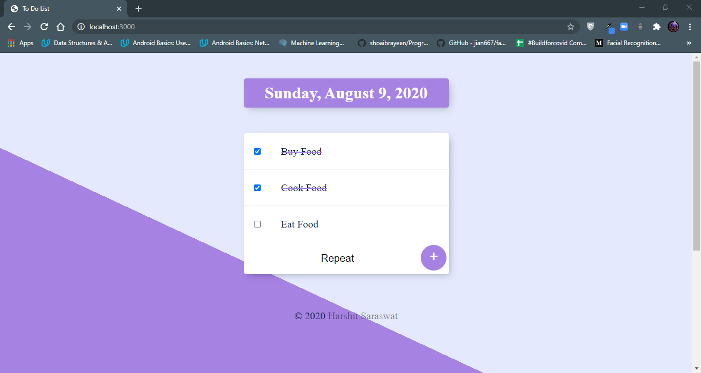
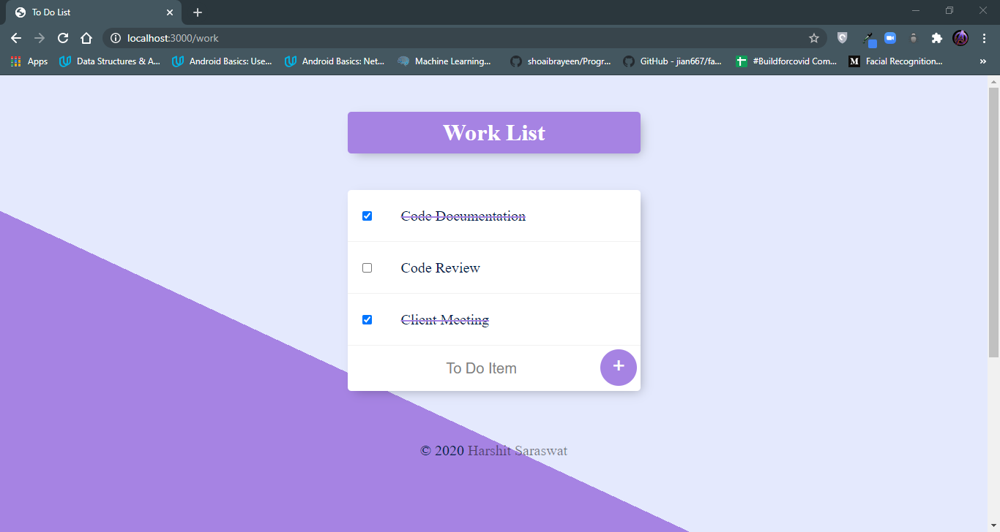

# TODO-List-App
This is one of the projects for The Complete Web Development Bootcamp Course.

The Web app focusses on implementing Full Stack Web Development Using NodeJS and ExpressJS as backend along with use of requests module for working with third party apis.

This project is a template for a simple todo list app without any database. This is a v1 project. Will add database functionality later.

## Snapshots:
### Todo List Page-

### Work Todo List Page-

## Inspiration:
The inspiration for the website have been taken from the follwing:
* [Angela Yu](https://github.com/angelabauer)'s Complete Web Development Bootcamp Course on Udemy.

## Acknowledgements:
I'd like to express my greatest gratitude towards Angela Yu for her amazing teaching efforts and course.
For the website I've used the following resources:
* ***Icons***: [FlatIcons](https://www.flaticon.com/)
* ***Fonts***: [GoogleFonts](https://fonts.google.com/)
* ***Bootstrap***: [Bootstrap](https://getbootstrap.com/)
* ***External Packagers***: [NPM](https://www.npmjs.com/)